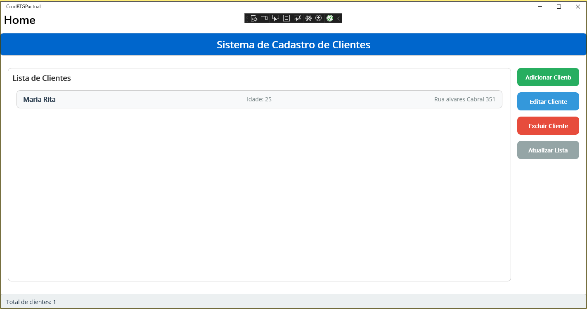

# Cadastro de Clientes - BTG Pactual

## Descrição
Aplicação desenvolvida em .NET MAUI 9 para cadastro de clientes, implementando operações CRUD (Create, Read, Update, Delete) com interface Windows desktop.

## 🛠️ Tecnologias Utilizadas
- .NET MAUI 9
- C#
- MVVM Pattern
- Dependency Injection
- Windows Desktop Platform

## 📋 Funcionalidades
- ✅ Listagem de clientes
- ✅ Inclusão de novos clientes
- ✅ Edição de clientes existentes
- ✅ Exclusão de clientes
- ✅ Validação de campos
- ✅ Persistência em memória
- ✅ Interface responsiva

## 🏗️ Arquitetura
O projeto segue o padrão MVVM (Model-View-ViewModel):
- **Models**: Entidades de dados (Cliente)
- **Views**: Interfaces de usuário (XAML)
- **ViewModels**: Lógica de apresentação e binding
- **Services**: Serviços de dados e regras de negócio

## 🖼️ Screenshots da Aplicação

### Tela Principal - Lista de Clientes


### Adicionando um Novo Cliente


### Editando um Cliente


### Confirmação de Exclusão de Cliente


## 📁 Estrutura do Projeto
```
CrudBTGPactual/
├── Models/
│   └── Cliente.cs
├── Views/
│   ├── MainPage.xaml
│   ├── ClienteAddPage.xaml
│   └── ClienteEditPage.xaml
├── ViewModels/
│   ├── MainPageViewModel.cs
│   ├── ClienteAddViewModel.cs
│   └── ClienteEditViewModel.cs
├── Services/
│   ├── IClienteService.cs
│   └── ClienteService.cs
├── ScreenShots/
│   ├── TelaPrincipal.png
│   ├── TelaAdicao.png
│   ├── TelaPrincipalAlterado.png
│   └── TelaPrincipalExcludoCliente.png
└── README.md
```

## ✨ Recursos Implementados

### Obrigatórios
- [x] Padrão MVVM
- [x] Classe Cliente com Name, Lastname, Age, Address
- [x] Tela inicial com lista e operações CRUD
- [x] Janelas modais para operações
- [x] Injeção de dependência
- [x] Repositório público no GitHub

### Opcionais
- [x] Validação de tipos de dados
- [x] Janela principal maximizada
- [x] Janelas de operação centralizadas
- [x] Testes unitários básicos
- [ ] Persistência de dados (implementação futura)

## 🧪 Testes
O projeto inclui testes unitários para os ViewModels e Services:
```bash
dotnet test
```